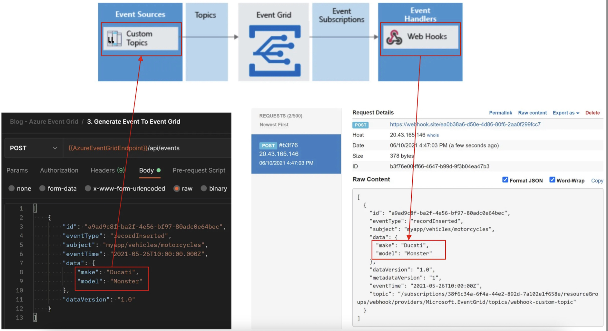

# Event-Driven Architectures with Azure Event Grid
แนวทางการพัฒนา Event-Driven Architectures เพื่อเชื่อมต่อข้อมูลได้จากหลากหลายแหล่งข้อมูล และตัวอย่างการพัฒนาด้วย Azure Event Grid (Custom Topic, Web Hooks)

# Slide
https://docs.google.com/presentation/d/1qUo_zVixoW0j3D6B2JOqaOcx-n8McNAcHMl96-9cnoI/edit?usp=sharing

# Video
- https://youtu.be/t92pmvJVExE
- https://youtu.be/aaRpfOKIffQ?si=4ULEqZVJpfWZBxQJ

# Blog
https://medium.com/t-t-software-solution/%E0%B9%81%E0%B8%99%E0%B8%A7%E0%B8%97%E0%B8%B2%E0%B8%87%E0%B8%81%E0%B8%B2%E0%B8%A3%E0%B8%9E%E0%B8%B1%E0%B8%92%E0%B8%99%E0%B8%B2-event-driven-architectures-%E0%B8%94%E0%B9%89%E0%B8%A7%E0%B8%A2-azure-event-grid-%E0%B8%84%E0%B8%A3%E0%B8%B1%E0%B8%9A-8071f7d15f58

# Postman Files
- [Collection](./Postman/Blog%20-%20Azure%20Event%20Grid.postman_collection.json)
- [Environment](./Postman/Blog%20-%20Azure%20Event%20Grid.postman_environment.json)

# References
- [Microsoft Learn: Introduction to cloud-native applications](https://learn.microsoft.com/en-us/dotnet/architecture/cloud-native/introduction)
- [Microsoft Learn: Choose a messaging model in Azure to loosely connect your services](https://learn.microsoft.com/en-us/training/modules/choose-a-messaging-model-in-azure-to-connect-your-services/)
- [Microsoft Learn: Receive events to an HTTP endpoint
](https://docs.microsoft.com/th-th/azure/event-grid/receive-events )
- [Somkiat.cc: MICROSERVICE-2023-DESIGN](https://github.com/up1/course_microservices-3-days/blob/master/slide/MICROSERVICE-2023-DESIGN.pdf)
- [Slalom Technology: Azure Messaging: When to use What and Why?](https://medium.com/slalom-technology/azure-messaging-when-to-use-what-and-why-post-3-8a914ec74822)
